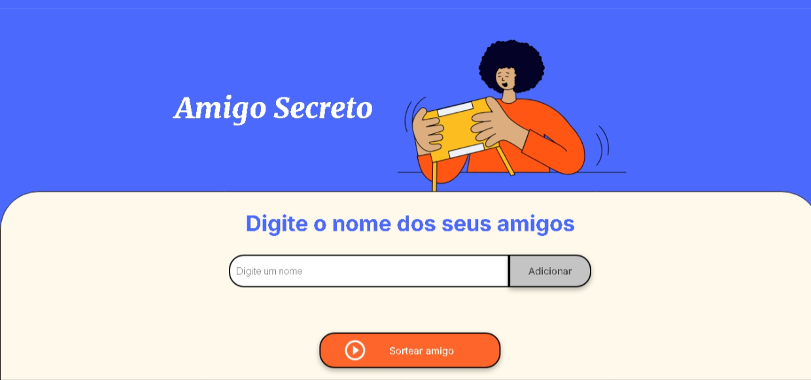

# Desafio do amigo secreto
Esse desafio foi proposto no programa ONE, uma parceria da Oracle com a Alura.

## Ideia
A ideia do projeto era atualizar um design pronto de HTML e CSS para permitir que o usuário adicionasse nomes de amigos a uma lista e pudesse sortear um nome ao fim do processo.

